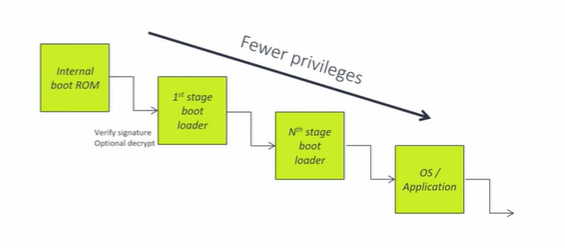
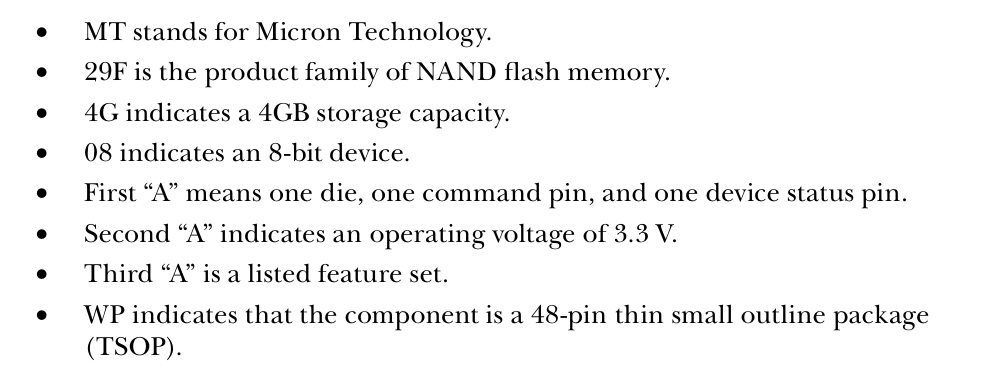
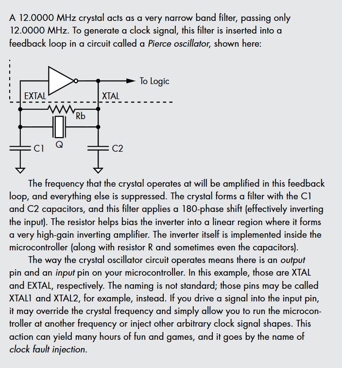

# Secure boot
Here's shown the chain of trust

## verification mistakes
1.  Sign Everything
2.  Firmware Upgrade
limit functionality, sign individual blocks, implement anti rollback
3.  Logical Bugs
Code review, fuzzing Limiting fnctionality to bare minimum
4.  TOCTOU Race conditions
TOCTOU (Time-of-Check to Time-of-Use) es una vulnerabilidad de software, una clase de condición de carrera, que ocurre cuando hay una brecha de tiempo entre la verificación del estado de un recurso (como un archivo o una credencial) y su uso posterior,
5. Timing attacks
Implementing a xor comparsion instead of an if
6. Fault Injection
Defensive Coding
7. State errors
Sign & verify analyze all state variables
8. Debug/jtag service ports
disable
9.  Key Management
Clear register of crypto engines
10. Wrong use of crypto

# 25

![[Pasted image 20251222103206.png]]

## Push-Pull 
If I want to send data only to you, the simple 0 V to 5 V method used earlier would work fine. This is called a push-pull output, because I will push your input to 5 V, or I will pull your input to 0 V. You get no say in the matter, and neither does anyone else. But what if you now want to reverse direction and send data to me over the same interconnecting wires? I would need to keep quiet and go into high-impedance mode so that you’d have the opportunity to respond to me. For communication to happen, one party must be talking, while the other party must be listening. 

![[Pasted image 20251222103507.png]]
## Open Collector or Open Drain 
Open collector and open drain refer to different ways of connecting transis- tors to wires. Instead of having zero and one outputs, open collector tran- sistors have zero and Hi-Z states. If we combine several transistor collector outputs on a wire with a single pullup resistor, any one of those connected collectors can pull the wire to 0 V to send one bit of information along the common wire to the next input. This signal has to be carefully synchronized with the other collectors, which should remain in the Hi-Z state when the sig- nal is being sent. This technique allows for communication using transistors.

# Low-Speed Serial Interfaces
## Universal Asynchronous Receiver/Transmitter 
Serial This protocol is known by several names—serial, RS-232, TTL Serial, and UART—
Receiver/transmitter refers to the fact that one device can commu- nicate both ways if both wires in the serial cable are connected. A bidirectional UART interface needs two wires (and ground) for Device A and Device B to communicate (see Figure 2-7). RX A B TX GND RX TX GND

![[Pasted image 20251222103703.png]]

RS-232 is the most ubiquitous UART standard, but it has an interest- ing quirk. Designed many years ago for linking devices over cables that were several meters long, it defines logic one (which is also called a mark) as anything between –3 V and –15 V and logic zero (which is also called a space) as anything between +3 V and +15 V. At the far end of the cable, you were expected to be tolerant of any voltage between +25 V and –25 V in case of voltage drift, which is way out of the signal ranges in today’s low-voltage systems that rarely range far beyond 0 V and 3 V. 
TTL serial, using the TTL 0 V/5 V logic levels, is otherwise identical to RS-232 in format. This means you can use a UART to communicate without the need for any additional voltage converter chips. You may find people specifying different voltage levels (such as “3.3 V TTL serial”) to show they’re not using the classic 0 V/5 V logic level, but rather a 0 V/3.3 V logic level.

The UART protocol is relatively straightforward. , if I am idle, I’ll continuously transmit a logic one (mark). When I’m ready to send you a byte’s worth of bits, I’ll begin with a logic zero “start bit” to signal the start of my transmission. I’ll follow that with the rest of my bits, the least significant bit in each byte being sent first. (A byte is a grouping of bits.) I can optionally include parity information for error detection in the byte. Finally, I can send one or more logic one “stop bits” to signal the end of my byte. In order for you to inter- pret my transmission properly, we need to agree on a few parameters: 
**Baud rate** The number of bits per second that I will transmit and you will receive. 
**Byte length** The number of bits in a byte. This is almost universally eight now, but UART supports alternate lengths. 
**Parity** N for no parity, E for even, and O for odd—the parity bit is added as an error detection measure to indicate whether the total num- ber of ones in the byte is even or odd.
**Stop bits** The length of the stop signal bit, which is often 1, 1.5, or 2.

For example, if I specified 9600/8N1, you should expect to see 9,600 bits per second, 8-bit bytes, no parity bit, and one stop bit (see Figure 2-8).  In *nix operating systems, the interconnection appears as a TTY device; in Windows operating systems, it appears as a COM port
![[Pasted image 20251222104140.png]]

## Serial Peripheral Interface

The serial peripheral interface (SPI) is a low pin-count, controller-peripheral, source-synchronous serial interface. Typically, it contains one controller on a bus and one or more peripheral devices. Whereas UART is a peer-to-peer interface, SPI is controller-peripheral, meaning that the peripheral only ever responds to the controller’s requests and can’t initiate communication. 
SPI is source synchronous, so the SPI controller transmits the clock to the peripheral receiver. This means the peripheral and controller don’t need to agree ahead of time on baud rate (clock frequency) since it is provided. SPI usually runs much faster than UART protocols (UART typically runs at 115.2 kHz; SPI typically runs at 1–100 MHz). 
Figure 2-9 shows the four wires that carry the signals for SPI communi- cation between C (controller) and P (peripheral)—SCK (serial clock), COPI (controller out peripheral in), CIPO (controller in peripheral out), and *CS (chip select)—as well as GND (ground). As you might notice from the pinout names, no ambiguity or swapping of transmit and receive pins exists, since either side has a clearly defined controller and peripheral. Electrically, all the SPI outputs are push-pull, which is fine, because the SPI interface is designed to have only one control- ler on the wire.

![[Pasted image 20251222110655.png]]

The chip select pin is labeled with an asterisk (CS) to indicate that it’s active-low, meaning the high voltage is false and 0 V is true. If you were the peripheral device on an SPI interface, you would need to sit quietly (in high impedance mode) until I assert *CS by setting it to 0 V. 
At that point, you would have to listen to SCK and COPI for your commands, and only when it’s your turn could you respond on the CIPO pin. An advantage of having a *CS pin is that I, as a controller, might actu- ally have several different *CS pins, one for each peripheral. Since you’re required to stay in high impedance mode until your *CS pin is selected, other peripherals can share the SCK, COPI, and CIPO pins. This allows adding more SPI peripheral devices to a single controller at the cost of only the single additional *CS wire per peripheral. N O T E The active-low notation will commonly be one of three options. The pin name will have an overline above it (CS), the pin will have a slash in front of it (/CS), or the pin will have an asterisk in front of it, as used with the *CS example.

# Inter-IC Interface
The inter-IC interface, also called IIC, I2C, I2C (pronounced “I-square-C”), two-wire (TWI), and SMBus, is a low pin-count, multicontroller, source- synchronous bus. The multitude of names is primarily due to minor dif- ferences and trademark issues. I2C was a claimed trademark, so companies used a different name for the same bus. You’ll see I2C is very similar to SPI in most respects, and you’re likely to find exactly the same devices with either SPI or I2C interfaces. You might notice, however, that I2C is “multicontroller,” whereas SPI is “controller-peripheral.” Figure 2-10 helps clarify this.
![[Pasted image 20251222110900.png]]

The complete “bus” consists of two wires: SDA and SCL. Each wire con- nects to every SDA or SCL pin of all I2C ports connected to the bus. Each wire has a single pullup resistor. An inactive I2C port will put both SDA and SCL pins into high-impedance mode. This means if no other devices are talking, both lines will sit at logic one, and any device can take ownership of the bus by pulling down the SCA line. An I2C device can be a controller Reaching Out, Touching Me, Touching You: Hardware Peripheral Interfaces 51 only, a peripheral only, or it can act as a controller or a peripheral at differ- ent points in time. Let’s pretend you and I are two bus controllers on an I2C bus, connected to an I2C peripheral EEPROM. If we want to access the EEPROM, we check to see what the SDA and SCL lines are doing. If they’re both sitting at logic one, the bus is not in use, and I can take control of it by sending a START condition (that is, by setting SDA to 0, while SCL stays at 1). At this point, you need to stand back and wait until I’m done with the bus. I’ll signal this with a STOP condition by setting SDA to 1 while SCL stays at 1. Figure 2-11 shows the STOP conditions on the SCA and SCL lines

![[Pasted image 20251222110920.png]]
nce I’ve taken control of the bus, you, the EEPROM, and everyone else have to sit and listen for me to send out an address. Each device has a unique 7-bit address. Usually several bits are hard- coded, and the remainder are programmable via flash or pullup/pulldown resistors to differentiate multiple identical components connected to the same I2C bus. Following the 7-bit address comes a Read/*Write bit to indi- cate the direction the next byte of data will go. In order to read data from the EEPROM, I first tell the EEPROM from which memory address I want to read (which is a write operation—that is, a one on the eighth bit), then I have to tell the EEPROM to send the data at that memory location (which is a read operation—that is, a zero on the eighth bit). After every byte has been transferred over I2C, the recipient is required to acknowledge the byte. The sender releases the SDA line, and the controller toggles the SCL line. If the receiver has received all eight bits, it should set the SDA line to zero during this time. Figure 2-12 shows what SDA and SCL look like over time as the entire transaction takes place.

![[Pasted image 20251222111013.png]]
A complete sequence on SCA between a controller device and an EEPROM looks like the following: 1. Start sequence: The controller tells everyone else to be quiet and to lis- ten for their device address. 2. Peripheral address: The controller sends the 7-bit device address of the EEPROM it wants to read. 3. R/*W bit: The controller sends a zero because we first need to write an EEPROM memory address. 4. Acknowledge: The controller releases SDA and expects the EEPROM to signal reception of the device address by setting SDA to 0. 5. EEPROM address: The controller sends the 8-bit byte, which is the EEPROM memory address. 6. Acknowledge: The controller releases SDA and expects the EEPROM to signal reception of the memory address by setting SDA to 0. 7. Start sequence: The controller repeats the start sequence because it now wants to read. 8. Peripheral address: The controller resends the 7-bit EEPROM device address. 9. R/*W bit: The controller sends a one because it now wants to read data from the memory address it has just set. 10. Acknowledge: The controller releases SDA and expects the EEPROM to signal reception of the device address by setting SDA to zero. 11. EEPROM data: The EEPROM sends the 8 data bits from the memory address on SDA to the controller at the moment the controller tog- gles SCL. 12. Acknowledge: The controller sets SDA to zero to acknowledge it has received the byte. 13. Repeat: As long as the controller keeps toggling SDA and acknowledg- ing at the right time, the EEPROM will continue to send successive Reaching Out, Touching Me, Touching You: Hardware Peripheral Interfaces 53 bytes of data to the controller. When enough bytes are read, the con- troller will send a Not Acknowledge (NACK) to communicate to the peripheral. 14. Stop sequence: The controller tells everyone it is done, giving others a turn on the bus. During the entire sequence, the controller toggles SCL in order to syn- chronize its communication with the peripheral. One great advantage of this multicontroller bus is that it requires only two wires, no matter how many devices share it. A downside is that because there’s only a single pullup and all the devices need to be listening on the line at all times, the effective maximum throughput has to be lower than the design speed at which the SPI can communicate due to dividing the throughput among the devices. For this reason, you’re more likely to find only SPI EEPROMs at bus speeds greater than 1 MHz, while most other devices are equally likely to have plain SPI or I2C interfaces. Since it requires only two wires, I2C can be squeezed into a wide num- ber of hardware applications. For example, VGA, DVI, and even HDMI connectors use I2C in order to read a data structure from the monitor that describes the monitor’s output capabilities. In most systems, this I2C bus is even accessible from software in the event that you want to plug auxiliary devices into your system via spare VGA ports. Since I2C is a multicontroller bus, there is no problem whatsoever with jumping onto an I2C bus and acting as the controller, which is an option that does not always work as expected on an SPI bus.

# 25-12-22 Señales Osciloscopio
 A probe often attenuates (reduces the amplitude of) the signal source before forwarding the signal to the oscilloscope. For the probes that come with a scope, this attenuation is usually 10× and should be marked on your probe somewhere. 
 
 This means that a 1 V differential in your signal results in a 0.1 V differential on the input to your scope; however, your scope probe may be switchable between 1× (which does not attenuate) and 10× (which does attenuate). 
 
 The big advantage of attenuation is that it reduces the loading on your circuit and increases the frequency response of the scope. Using a scope probe in 1× mode typically means a low bandwidth (cannot measure high- frequency signals), and the electrical load of the scope probe may affect your circuit under test. For this reason, many high-performance oscillo- scope probes are fixed in 10× mode, as most users prefer the high-frequency response advantage of the 10× mode.

Any probe also needs to be impedance matched with your scope. The scope will have an input impedance (for example, 50 Ω or 1 MΩ), and your probe’s impedance needs to be the same to avoid signal degradation

## Bandwith
Both the scope and the probe will also have an analog bandwidth, expressed in Hz, which represents the maximum frequency they can measure. The probe and scope don’t need to be matched, but the total bandwidth of the probe and scope is limited by the component with the lowest bandwidth.

You can insert a low-pass filter to limit the bandwidth artificially, which can be handy to filter out noise in your signal. Similarly, you can add a high- pass filter, often used to remove DC or low-frequency components (many power supplies have low-frequency noise, for example). 

You can configure the scope channel in AC or DC coupling mode. DC coupling means it can measure all the way down to 0 Hz voltage (DC offsets), whereas AC coupling means very low frequencies are filtered out. For side- channel analysis, it’s usually not a big difference, so AC is a bit easier to use, as you don’t need to center the signal.
## ADCs Components

![[Pasted image 20251222102353.png]]

These ADCs operate at a programmable **sampling rate**, which means the number of times per second they output a new sample. A sample is sim- ply one measurement output. Normally, the sampling rate should be at least twice as fast as the highest frequency you want to capture, as stated in the Nyquist-Shannon sampling theorem. In practice, sampling higher than twice the highest frequency is better; go up to five times higher. 

If your oscilloscope measurement is synchronous to the target device, where each sample point occurs on the target clock cycle, you can get away with reduced sample rates. A series of samples is called a **trace**. A digital oscilloscope has a buffer to record traces, called the **memory depth**. Once the recording fills up the mem- ory, traces either need to be sent to a PC for processing or be discarded for the next measurement

The depth and sampling rate together determine the maximum length of a trace. For efficiency, it’s important to limit the trace length. The length of the trace is configured by the number of samples to acquire in a single trace.

An oscilloscope can be continuously measuring (recording) data, or else it can be started by an external stimulus called the **trigger**. The trigger is a digital signal that also comes into the scope through a dedicated trigger channel or normal probe channel.

# Webtools
https://es.ifixit.com/

Any digital device that emits radio waves, known as an intentional radia- tor, requires testing. The FCC requires manufacturers to test their devices’ emissions carefully and provide documentation proving devices meet FCC rules. It’s a very expensive process, and the FCC needs to ensure that it is easy for the public to check compliance.
[FCC ID Search](https://fccid.io/)

You can easily look up this patent num- ber on the United States Patent and Trademark Office (USPTO) website or on a third-party website, such as Google Patents. We recommend Google Patents, as it searches multiple databases and also contains an easily navi- gated search tool for general-purpose use.
105

## 
For instance, the datasheet for the MT29F4G08AAAWP breaks the part number down as follows:

# 26-5-29
Pierce Gate
